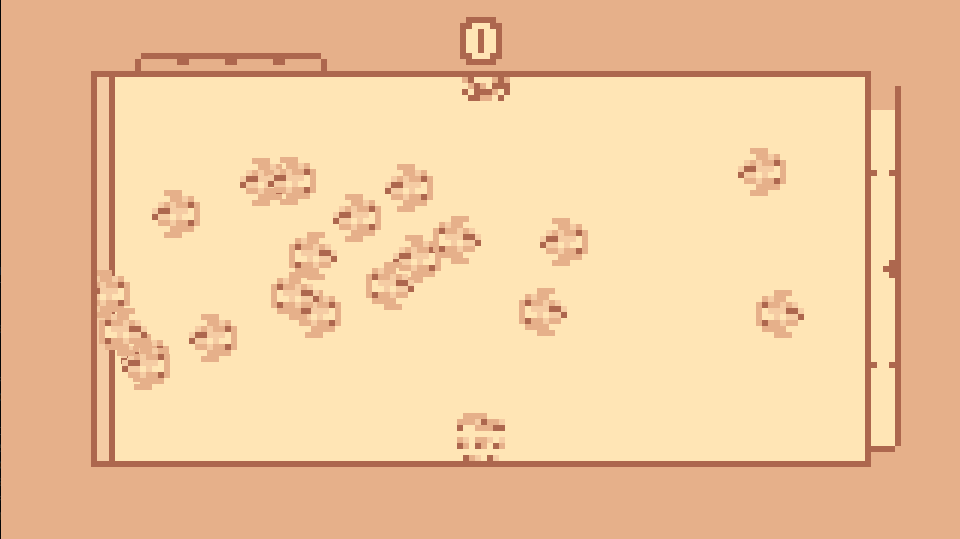
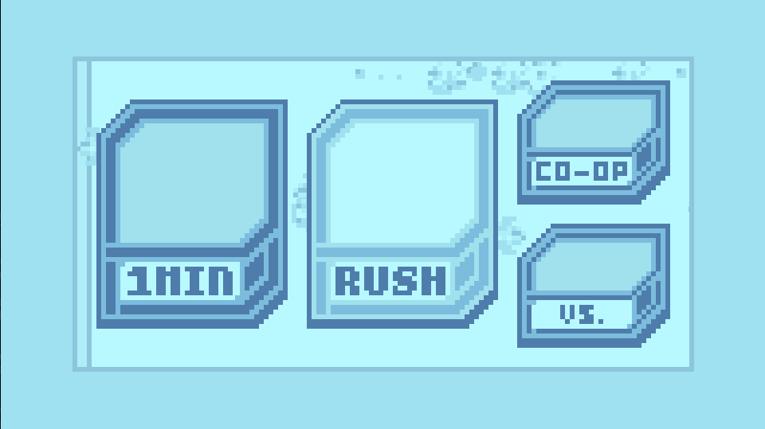
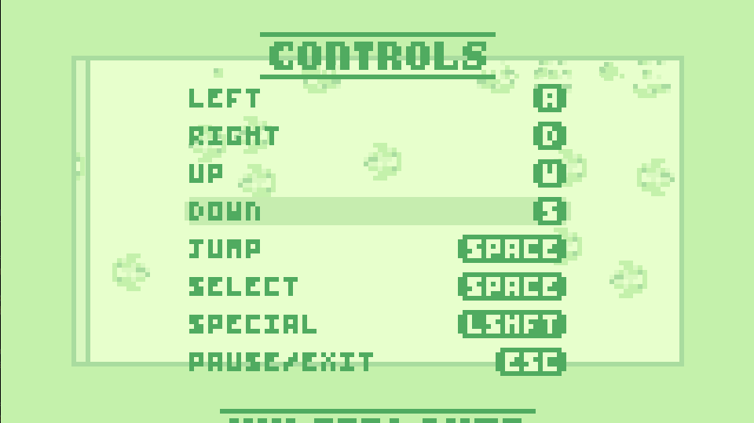

# Gravity Dash - *An arcade-style game made using SFML*

## Introduction

Gravity dash is a simple high-score based arcade game where players jump between the floor and ceiling of the game world, attempting to catch the targets flying past. Grabbing multiple targets within the same jump will increase your score exponentially, so try to aim for large clusters of targets! 

I have been working on this project for the better part of a year at this point, constantly iterating and improving what was already there, while adding new features when the opportunity arose. This project ended up expanding way past the scope I was expecting, and was a great experience in maintaining a larger codebase (relative to other projects I have done) and adhering to proper design principles. With all that said, I hope you enjoy this small little game I made!

#### *How to play*



The standard gameplay involves jumping between the floor and ceiling and catching as many targets as possible. Each target is worth *50* points, though every **additional target hit doubles this amount** (i.e. hitting three targets will award `50 + 2 * 50 + 4 * 50 = 350` points). However, simply waiting it out for large clusters may not end well, as **saws** will travel along the edges of the world, deducting *5000* points and stunning you if they come into contact. Additionally hitting at least two targets in one jump will award some **boost** to your boost meter, which decays over time. Filling up this meter will allow you to perform a special jump, launching at an angle and ricocheting of walls to get a huge score increase. Each target hit during a special jump awards a flat *1000* points.

#### *Modes*



Currently, there are two modes that have been fully implemented:

- **1 Minute** - The simplest mode, try to get the most points within 60 seconds!

- **Rush** - In this mode, an extra target type will be present, collecting this time extension target within a three-target combo will increase the timer's refill amount by 5 seconds, which will be added to the timer when it runs out. Every refill also increases the score multiplier, so try and last it out for a larger score!

#### *Settings and Controls*



By default, the game uses the standard WASD control scheme, using the WASD keys for movement, **space** for jumping and menu selection, **escape** for pausing and exiting, and **left shift** to use your special. However, these keybindings, as well as other game settings such as rendering scale and colour can be easily changed within the program itself. 

**Should the settings become corrupted or otherwise prevent you from playing the game, simply delete the JSON file found in `files/save.json` to reset the settings back to default.**

## Building
To build this project, you first must obtain the project files by either downloading the source code or cloning this repository. Once the project has been downloaded, navigate to the root directory and run the following CMake commands to first generate the build files and the build the full project:
```
cmake -B build
cmake --build build --config Release
```
Upon completion, the game files can be found in the `bin/` directory, alongside the game's sprites, shaders, and other files found in the `assets/` and `files/`directory. **Attempting to run the game without one or all of these files present may cause graphical errors!**

## Spacial Thanks
This project heavily uses SFML for a large part of the graphical front-end, and I appreciate everything the SFML team and the larger community have done to maintain and update the library! The GitHub repository for SFML can be found [here](https://github.com/SFML/SFML).

Additionally Nlohmann's JSON library was used to store program settings and scores, and is a great library for anyone wanting to use JSON within C++. The GitHub repository can be found [here](https://github.com/nlohmann/json).